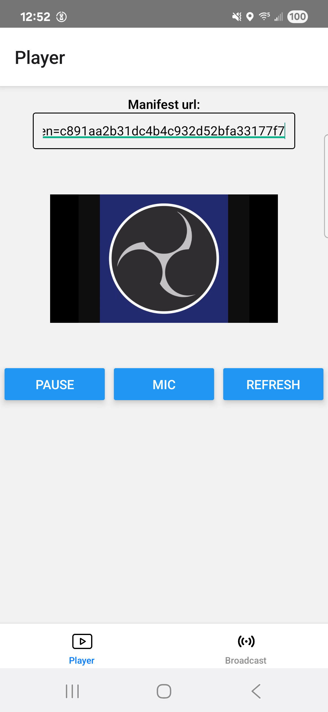
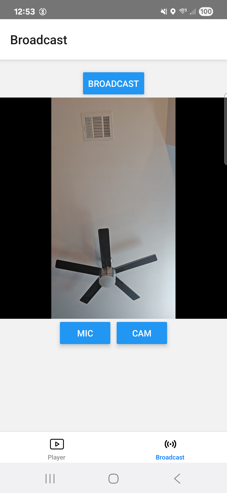

# react-native-native-frame-demo
This is a demo of how to use **@video/react-native-sdk**. 

## Running the demo
```bash
cd test-app
yarn

yarn android
yarn ios
```
<table>
  <tr>
    <td></td>
    <td></td>
  </tr>
</table>

## New to React Native?

If you're new to React Native, we recommend reviewing the official [React Native Getting Started Guide](https://reactnative.dev/docs/getting-started) to familiarize yourself with the framework and development environment setup.

# Using @video/react-native-sdk

React Native SDK for video streaming.

## Features

- 📹 **Live video streaming** with WebRTC and HLS support
- 📡 **Live broadcasting** with camera preview and optional controls
- 📱 **Cross-platform** - iOS and Android support
- 🔄 **Automatic fallback** between WebRTC and HLS

## Installation

### 📦 Install SDK and Dependencies

#### yarn  
```bash
# Install SDK
yarn add @video/react-native-sdk

# Install required peer dependencies with specific versions
yarn add react-native-video@^6.16.1 \
         react-native-webrtc@^124.0.0 \
         @react-native-picker/picker@^2.11.1 \
         @react-native-async-storage/async-storage@^2.2.0 \
         @react-native-community/netinfo@^11.4.1 \
         react-native-safe-area-context@^5.5.1 \
         react-native-screens@^4.11.1
```

#### npm
```bash
# Install SDK
npm install @video/react-native-sdk

# Install required peer dependencies with specific versions
npm install react-native-video@^6.16.1 \
           react-native-webrtc@^124.0.0 \
           @react-native-picker/picker@^2.11.1 \
           @react-native-async-storage/async-storage@^2.2.0 \
           @react-native-community/netinfo@^11.4.1 \
           react-native-safe-area-context@^5.5.1 \
           react-native-screens@^4.11.1
```

#### pnpm
```bash
# Install SDK  
pnpm add @video/react-native-sdk

# Install required peer dependencies with specific versions
pnpm add react-native-video@^6.16.1 \
         react-native-webrtc@^124.0.0 \
         @react-native-picker/picker@^2.11.1 \
         @react-native-async-storage/async-storage@^2.2.0 \
         @react-native-community/netinfo@^11.4.1 \
         react-native-safe-area-context@^5.5.1 \
         react-native-screens@^4.11.1
```

### 🍎 iOS Additional Setup
```bash
cd ios && pod install
```

---

## ⚡ One-Line Installation

#### yarn
```bash  
yarn add @video/react-native-sdk react-native-video@^6.16.1 react-native-webrtc@^124.0.0 @react-native-picker/picker@^2.11.1 @react-native-async-storage/async-storage@^2.2.0 @react-native-community/netinfo@^11.4.1 react-native-safe-area-context@^5.5.1 react-native-screens@^4.11.1
```

#### npm (7+)
```bash
npm install @video/react-native-sdk react-native-video@^6.16.1 react-native-webrtc@^124.0.0 @react-native-picker/picker@^2.11.1 @react-native-async-storage/async-storage@^2.2.0 @react-native-community/netinfo@^11.4.1 react-native-safe-area-context@^5.5.1 react-native-screens@^4.11.1
```

#### pnpm
```bash
pnpm add @video/react-native-sdk react-native-video@^6.16.1 react-native-webrtc@^124.0.0 @react-native-picker/picker@^2.11.1 @react-native-async-storage/async-storage@^2.2.0 @react-native-community/netinfo@^11.4.1 react-native-safe-area-context@^5.5.1 react-native-screens@^4.11.1
```

## Quick Start

See:
- [test-app/PagePlayer.tsx](test-app/PagePlayer.tsx)
- [test-app/PageEncoder.tsx](test-app/PageEncoder.tsx)

### Sample code
```javascript
import React from 'react';
import { View } from 'react-native';
import { ManifestPlayer, ManifestPlayerVideo, getSession } from '@video/react-native-sdk';

export default function App() {
  const mySession = getSession({
    backendEndpoint: '<your backend endpoint>', displayName: 'React-Native Demo', 
    streamName: 'react-native-demo'
  });

  return (
    <View style={{ flex: 1 }}>
      <ManifestPlayer 
        manifestUrl="<manifest URL>"
        session={mySession}
        autoplay
      >
        {({ manifestPlayer }) => (
          <ManifestPlayerVideo
            manifestPlayer={manifestPlayer}
            showButtons={true}
            showDriver={false}
            showQualitySelect={false}
          />
        )}
      </ManifestPlayer>
    </View>
  );
}
```

### Broadcasting Example
```javascript
import React from 'react';
import { View } from 'react-native';
import { Encoder, getSession } from '@video/react-native-sdk';

export default function BroadcastApp() {
  const mySession = getSession({
    backendEndpoint: '<your backend endpoint>', displayName: 'React-Native Demo', 
    streamName: 'react-native-demo'
  });

  return (
    <View style={{ flex: 1 }}>
      <Encoder session={mySession} />
    </View>
  );
}
```

## API Reference

### ManifestPlayer

The main component for video stream playing.

#### Props

| Prop | Type | Default | Description |
|------|------|---------|-------------|
| `manifestUrl` | `string` | - | Manifest URL for streaming |
| `session` | `Session` | - | **Required** - User session for authentication |
| `muted` | `boolean` | Start with audio muted |

#### Example
```javascript
<ManifestPlayer 
  manifestUrl="<manifest URL>"
  session={session}
  autoplay
  muted={false}
>
  {({ manifestPlayer }) => (
    <ManifestPlayerVideo manifestPlayer={manifestPlayer} />
  )}
</ManifestPlayer>
```

### ManifestPlayerVideo

Video player UI component with controls.

#### Props

| Prop | Type | Default | Description |
|------|------|---------|-------------|
| `manifestPlayer` | `ManifestPlayer` | - | **Required** - Player instance |
| `showButtons` | `boolean` | `false` | Show play/pause/refresh controls |
| `showDriver` | `boolean` | `false` | Show current driver info |
| `showQualitySelect` | `boolean` | `false` | Show quality selection dropdown |
| `fixedWidth` | `boolean` | `false` | Use fixed width layout |

### Encoder

Component for live video broadcasting with camera preview.

#### Props

| Prop | Type | Default | Description |
|------|------|---------|-------------|
| `session` | `Session` | - | **Required** - User session for authentication |

#### Example
```javascript
import { Encoder, getSession } from '@video/react-native-sdk';
const mySession = getSession({
   backendEndpoint: '<your backend endpoint>', displayName: 'React-Native Demo', 
   streamName: 'react-native-demo'
});

<Encoder session={mySession} />
```

**Features:**
- Live camera preview
- One-tap broadcasting 
- Front camera setup by default

### Utilities

#### getSession

Creates and returns a session object for authentication with the video streaming service.

**Parameters:**

| Parameter | Type | Required | Description |
|-----------|------|----------|-------------|
| `backendEndpoint` | `string` | Yes | Your backend endpoint URL |
| `displayName` | `string` | Yes | Display name for the session |
| `streamName` | `string` | Yes | Unique stream identifier |

**Returns:** `Session` object

## ⚠️ Important Notes

- **Do not skip other dependencies** - Needed for React Native's native linking requirements
- **Version compatibility is critical** - Use the specified versions for best results  
- **iOS users must run `pod install`** after installing native modules
- **SDK requires camera/microphone permissions** on device

## 🔧 Troubleshooting

### Video not showing with manifestUrl

**Possible causes:**
1. Manifest URL is incorrect or unreachable
2. Network permissions not configured

## Requirements

- **React Native:** >= 0.78.0
- **React:** >= 18.2.0
- **iOS:** >= 15.1
- **Android:** >= API 24 (Android 7.0)

## Permissions in your app that uses the sdk

### iOS (ios/[your app]/Info.plist)
```xml
<key>NSCameraUsageDescription</key>
<string>This app needs camera access for video streaming</string>
<key>NSMicrophoneUsageDescription</key>
<string>This app needs microphone access for audio streaming</string>
```

### Android (android/app/src/main/AndroidManifest.xml)
```xml
<uses-permission android:name="android.permission.CAMERA" />
<uses-permission android:name="android.permission.RECORD_AUDIO" />
<uses-permission android:name="android.permission.INTERNET" />
```
